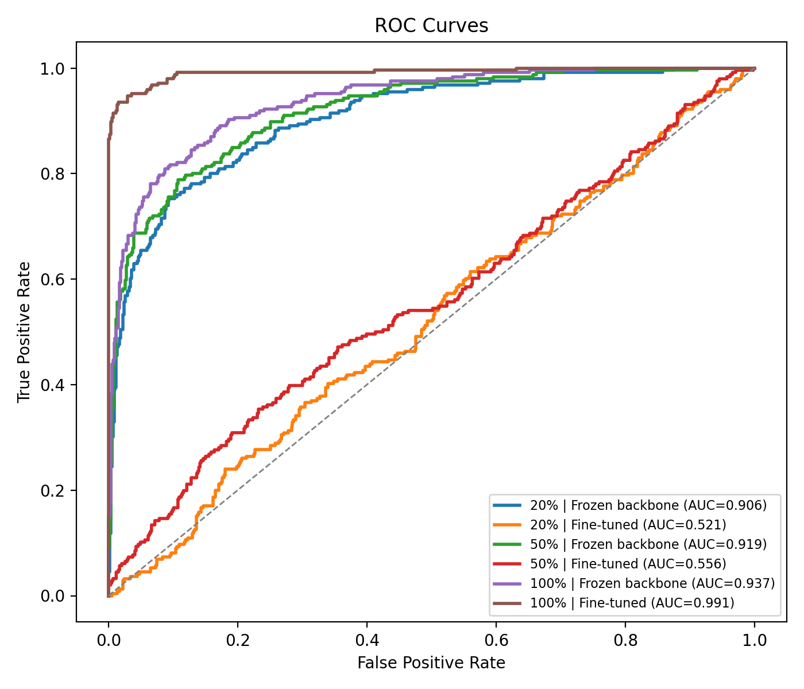
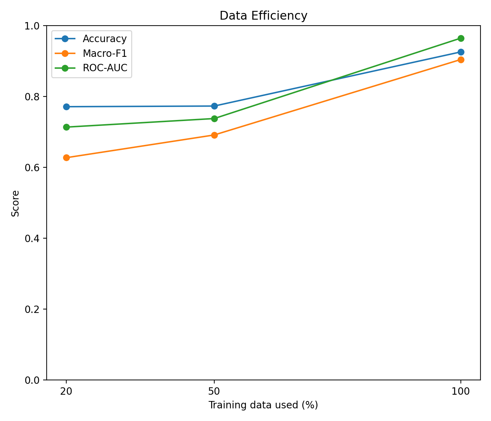
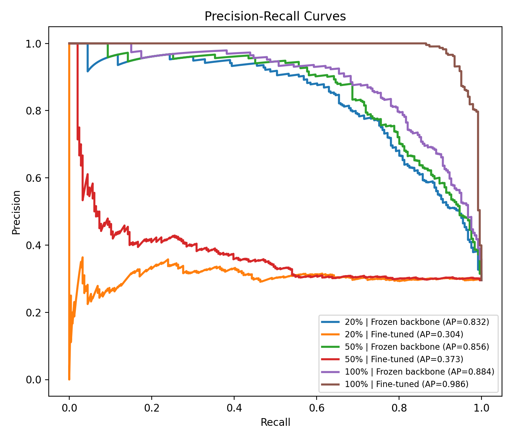

# Knee OA Classification - Final Project
Adaptation of Vision Foundation Model for Knee Osteoarthritis Classification

---

## Introduction
This project investigates the use of pretrained vision foundation model for automated detection of knee osteoarthritis (OA) from anterior-posterior (AP) radiographs. Specifically, we use a DINOv2 vision transformer to classify images into OA and non-OA categories. We evaluate model performance changes with varying amounts of training data and different adaptation strategies (frozen vs. fine-tuned backbone).

A key focus of this work is evaluating how model performance changes under different data availability conditions, reflecting real-world clinical scenarios where labeled medical data is often limited.

---

## Methods

### Dataset
The dataset consists of 4,156 AP knee radiographs from 2,655 unique subjects. Each image is labeled using the Kellgren–Lawrence (KL) grading system:

- KL < 2 → No OA
- KL ≥ 2 → OA

Images are organized into two classes:
- **Knee OA**
- **No-Knee OA**

Images are labeled as follows:
- 0: No OA (KL < 2)
- 1: OA (KL ≥ 2)

Some subjects have one radiograph (left or right knee), while others have both. To prevent data leakage, all dataset splits (train/validation/test) are performed at the subject level, ensuring that images from the same patient do not appear in multiple splits.

---

### Preprocessing
- Images resized to 224 × 224
- Normalized using ImageNet-based statistics
- Data augmentation applied during training

---

### Model
- Backbone: DINOv2 Vision Transformer (ViT) 
- Classifier: MLP (Linear → ReLU → Dropout → Linear)

---

### Training
- Loss function: Cross-Entropy (with class weights)
- Optimizer: AdamW
- Batch size: 16
- Epochs: up to 15
- Early stopping based on validation Macro-F1

---

### Evaluation Metrics
- Accuracy
- Precision
- Recall
- F1-score
- Macro-F1
- ROC-AUC

---

## Experimental Setup
We evaluate model performance under three data availability settings:

- 20% training data (low-data availability)
- 50% training data (moderate-data availability)
- 100% training data (full-data availability)

Each experiment also evaluates two adaptation strategies:
- Frozen (feature extraction)
- Fine-tuned (full model training)

All experiments use the same architecture and training settings to ensure fair comparison across conditions.

---

## Results

### Overall performance table:
| Data % | Backbone | Accuracy | Precision | Recall | F1-score | Macro-F1 | ROC-AUC |
|--------|----------|----------|-----------|--------|----------|----------|---------|
| 20%    | Frozen   | 0.8654   | 0.8941    | 0.6179 | 0.7308   | 0.8205   | 0.9188  |
| 20%    | Finetune | 0.5745   | 0.3043    | 0.3415 | 0.3218   | 0.5059   | 0.5047  |
| 50%    | Frozen   | 0.8918   | 0.8939    | 0.7195 | 0.7973   | 0.8618   | 0.9330  |
| 50%    | Finetune | 0.5974   | 0.3308    | 0.3537 | 0.3418   | 0.5259   | 0.5516  |
| 100%   | Frozen   | 0.8930   | 0.8945    | 0.7236 | 0.8000   | 0.8635   | 0.9305  |
| 100%   | Finetune | 0.5697   | 0.3170    | 0.3943 | 0.3514   | 0.5148   | 0.5225  |

### Key Observations

- Frozen backbone models consistently outperform fine-tuned models across all data regimes.
- Performance improves substantially from 20% to 50% of the data, with only small gains from 50% to 100%.
- Fine-tuning leads to unstable training and significantly worse performance, particularly in low-data settings.
  
### Figures

- **ROC Curves** - Performance comparison across data regimes and adaptation strategies

- **Data Efficiency** - How model performance scales with training data availability

- **Precision-Recall Curves** - Trade-off between precision and recall for each configuration

- **Confusion Matrices** - Per-configuration classification results
  - [20% Frozen](dinov2_outputs/confusion_matrices/cm_20pct_frozen.png)
  - [20% Fine-tuned](dinov2_outputs/confusion_matrices/cm_20pct_finetuned.png)
  - [50% Frozen](dinov2_outputs/confusion_matrices/cm_50pct_frozen.png)
  - [50% Fine-tuned](dinov2_outputs/confusion_matrices/cm_50pct_finetuned.png)
  - [100% Frozen](dinov2_outputs/confusion_matrices/cm_100pct_frozen.png)
  - [100% Fine-tuned](dinov2_outputs/confusion_matrices/cm_100pct_finetuned.png)

---

## Discussion

1. **Data Efficiency**
- Model performance improves significantly from 20% to 50% of the dataset, with smaller gains from 50% to 100%. This suggests that the pretrained DINOv2 model is relatively data-efficient when using pretrained features and the optimal percent is closer to 50% than 100%.

2. **Model Behavior**
- Across all dataset sizes, the model performs well when using frozen backbone, indicating that pretrained features generalize effectively to knee OA classification. Performance remains strong even in the low-data setting, suggesting the learned representations from DINOv2 are highly transferable to this medical imaging task.

3. **Adaptiation Strategy**
- FIne-tuning the full model does not improve performance and leads to instability and poor generalization. This is likely due to the smaller dataset size and overfitting of the model. Lower accuracy, F1-score, and ROC-AUC were observed across all data settings.

4. **Stability**
- The frozen backbone configuration is significantly more stable across training runs and dataset sizes. It produces consistent and high-performing results. In comparison, fine-tuning leads to unstable training behavior and poor generalization especially in the low-data run.

---

## Conclusion 
This project investigates the use of vision foundation models for automated knee osteoarthritis detection and evaluates how data availability impacts classification performance in a medical imaging setting. We demonstrate that vision foundation models such as DINOv2 can be effectively applied to medical imaging tasks like knee osteoarthritis classification. Using a frozen backbone with a simple MLP classifier provides strong performance, high stability, and efficient use of limited training data. These findings highlight the practical value of pretrained models in clinical applications where labeled data is limited.
