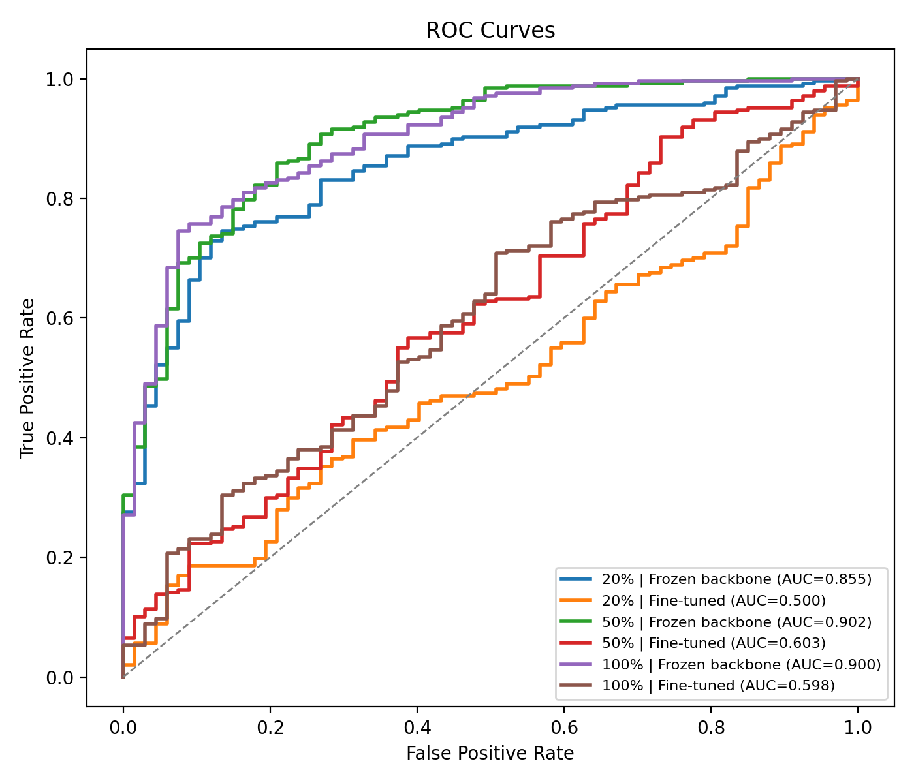
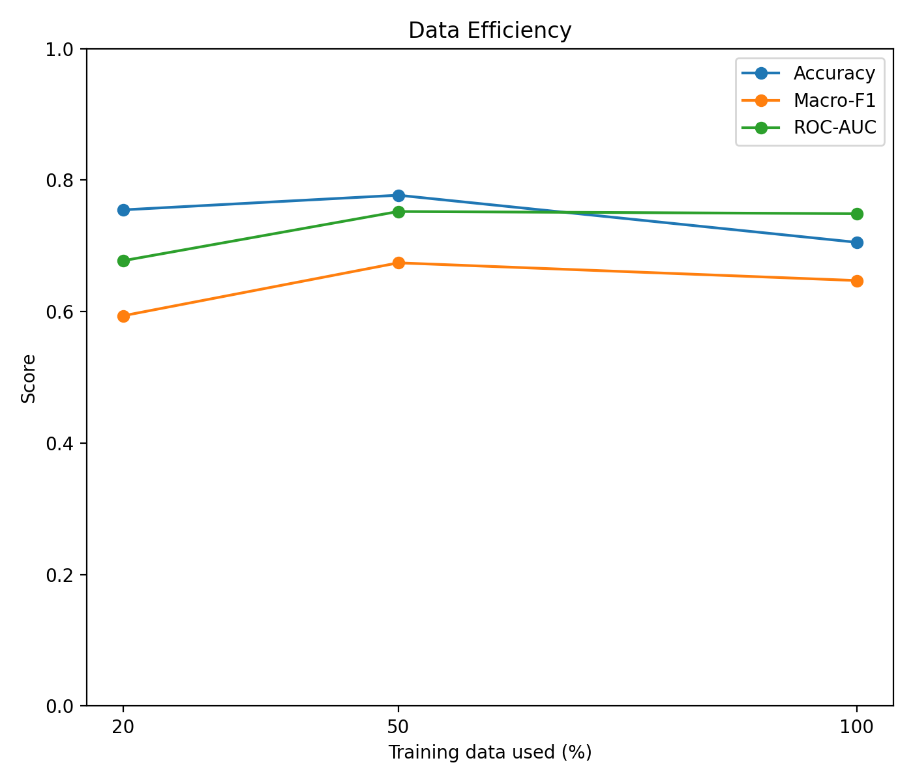
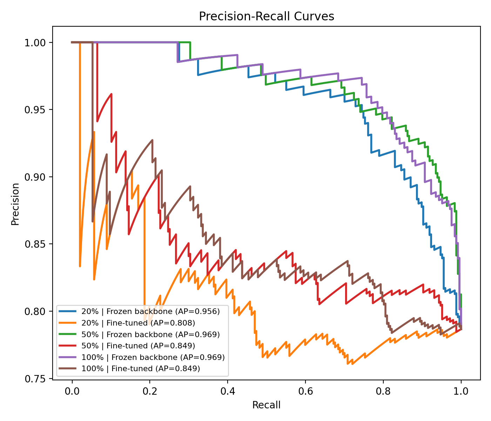
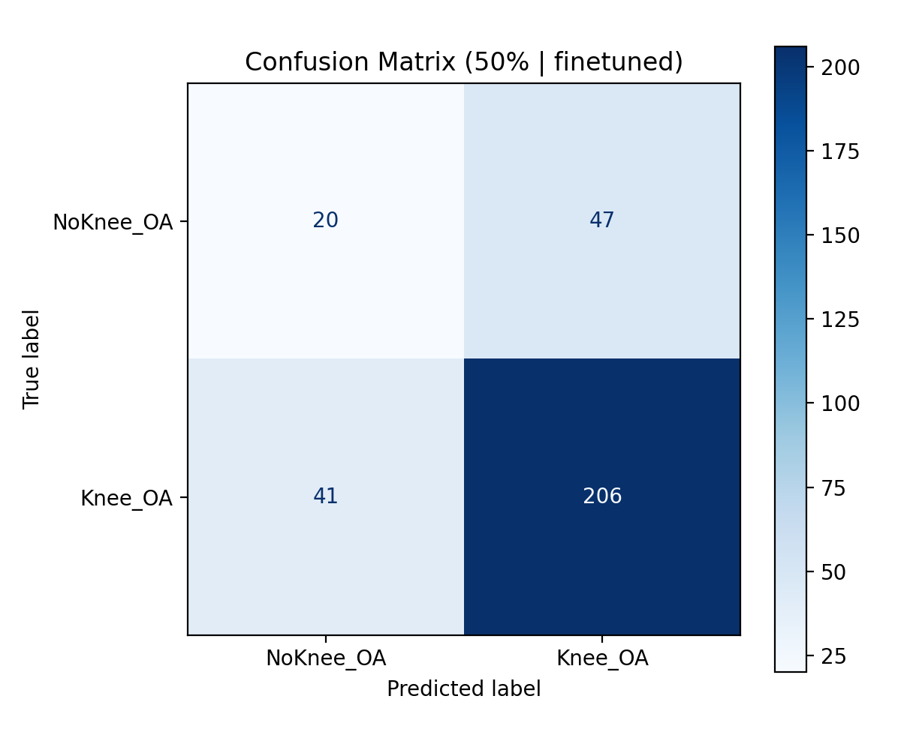
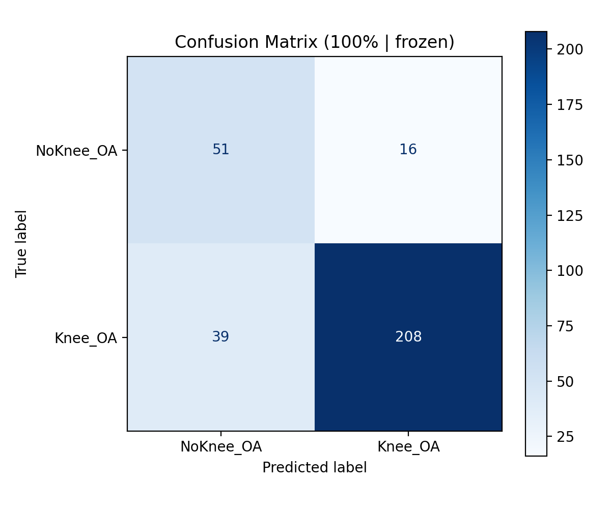
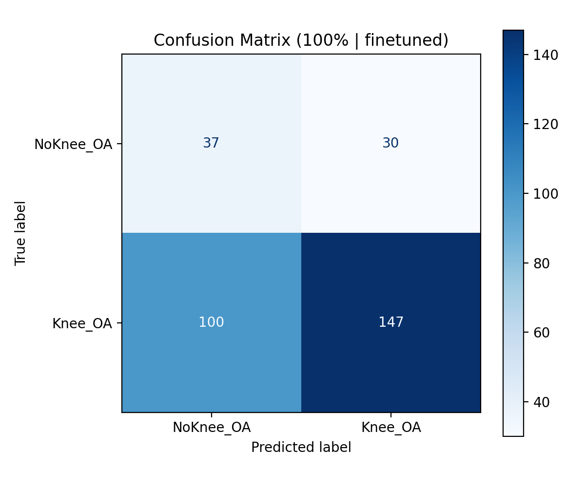

# Knee OA Classification - Final Project
Adaptation of Vision Foundation Model for Knee Osteoarthritis Classification

---

## Introduction
This project investigates the use of pretrained vision foundation model for automated detection of knee osteoarthritis (OA) from anterior-posterior (AP) radiographs. Specifically, we use a DINOv2 vision transformer to classify images into OA and non-OA categories. We evaluate model performance changes with varying amounts of training data and different adaptation strategies (frozen vs. fine-tuned backbone).

A key focus of this work is evaluating how model performance changes under different data availability conditions, reflecting real-world clinical scenarios where labeled medical data is often limited.

---

## Methods

### Dataset
The dataset consists of 4,156 AP knee radiographs from 2,655 unique subjects. Each image is labeled using the Kellgren–Lawrence (KL) grading system:

- KL < 2 → No OA
- KL ≥ 2 → OA

Images are organized into two classes:
- **Knee OA**
- **No-Knee OA**

Images are labeled as follows:
- 0: No OA (KL < 2)
- 1: OA (KL ≥ 2)

Some subjects have one radiograph (left or right knee), while others have both. To prevent data leakage, all dataset splits (train/validation/test) are performed at the subject level, ensuring that images from the same patient do not appear in multiple splits.

---

### Preprocessing
- Images resized to 224 × 224
- Normalized using ImageNet-based statistics
- Data augmentation applied during training

---

### Model
- Backbone: DINOv2 Vision Transformer (ViT) 
- Classifier: MLP (Linear → ReLU → Dropout → Linear)

---

### Training
- Loss function: Cross-Entropy (with class weights)
- Optimizer: AdamW
- Batch size: 16
- Epochs: up to 15
- Early stopping based on validation Macro-F1

---

### Evaluation Metrics
- Accuracy
- Precision
- Recall
- F1-score
- Macro-F1
- ROC-AUC

---

## Experimental Setup
We evaluate model performance under three data availability settings:

- 20% training data (low-data availability)
- 50% training data (moderate-data availability)
- 100% training data (full-data availability)

Each experiment also evaluates two adaptation strategies:
- Frozen (feature extraction)
- Fine-tuned (full model training)

All experiments use the same architecture and training settings to ensure fair comparison across conditions.

---

## Results

### Overall performance table:
| Data % | Backbone | Accuracy | Precision | Recall | F1-score | Macro-F1 | ROC-AUC |
|--------|----------|----------|-----------|--------|----------|----------|---------|
| 20%    | Frozen   | 0.7739   | 0.9314    | 0.7692 | 0.8426   | 0.7207   | 0.8551  |
| 20%    | Finetune | 0.7357   | 0.7828    | 0.9190 | 0.8454   | 0.4667   | 0.4998  |
| 50%    | Frozen   | 0.8344   | 0.9372    | 0.8462 | 0.8894   | 0.7801   | 0.9016  |
| 50%    | Finetune | 0.7197   | 0.8142    | 0.8340 | 0.8240   | 0.5682   | 0.6029  |
| 100%   | Frozen   | 0.8248   | 0.9286    | 0.8421 | 0.8832   | 0.7665   | 0.8998  |
| 100%   | Finetune | 0.5860   | 0.8305    | 0.5951 | 0.6934   | 0.5281   | 0.5982  |

### Key Observations

- Frozen backbone models consistently outperform fine-tuned models across all data regimes, demonstrating the effectiveness of pretrained features for this task.
- Performance improves substantially from 20% to 50% of the data, with clear gains in accuracy, F1-Score, Macro-F1, and ROC-AUC. This indicates strong data efficiency in a low-data setting.
- At 100% training data, performance does not further improve and slightly decreases across several metrics, suggesting limited returns and potential overfitting or optimization limitations.
- Fine-tuning leads to unstable and inconsistent performance across all data regimes. Despite occasionally high recall and F1-scores, these models show low Macro-F1 and ROC-AUC, pointing to porr class balance and weak discrimination.
- The discrepancy between F1-score and Macro-F1 in fine-tuned models highlights class imbalance effects, where performance is biased toward the majority class despite seemingly strong overall metrics.
  
### Figures

- **ROC Curves** - Curves are shown for all six data regimes and adaptation strategies. Frozen backbone models show consistently higher AUC, indicating stronger discriminitive ability. Fine-tuned models show curves closer to the diagonal, pointing to weaker classification performance.

- **Data Efficiency** - This plot shows how model performance metrics change with training data availability. Performance improves significantly from 20% to 50%, but shows limited increases (and even slight decreases) at 100%.

- **Precision-Recall Curves** - These curves highlight the trade-off between precision and recall for each configuration. Frozen models achieve stronger precision-recall, while fine-tuned models show more variability. In some cases, fine-tuned models do achieve high recall, but at the expense of a lower precision.

- **Confusion Matrices** - Per-configuration classification results

  **20% Frozen:** Good balance between classes; strong detection of OA cases (109 correct)
  
 
    
  **20% Fine-tuned:** Poor performance - only 4 correct; model heavily biased toward predicting OA
  

  **50% Frozen:** Improved balance; fewer false negatives (38) and false positives (14); strong overall performance 
  

  **50% Fine-tuned:** Biased toward OA predication; high false positives (47) and false negatives (41); more balanced than 20% fine-tuned
  

  **100% Frozen:** More stable and balanced; low false positives (16) and false negatives (39); consistent performance across classes 
  

  **100% Fine-tuned:** Significant decline in performance; high false negatives (100)
  

---

## Discussion

1. **Data Efficiency**
- Model performance improves significantly from 20% to 50% of the dataset, with smaller gains from 50% to 100%. This suggests that the pretrained DINOv2 model is relatively data-efficient when using pretrained features and the optimal percent is closer to 20%-50% than 100%.

2. **Model Behavior**
- Across all dataset sizes, the model performs well when using frozen backbone, indicating that pretrained features generalize effectively to knee OA classification. Performance remains strong even in the low-data setting, suggesting the learned representations from DINOv2 are highly transferable to this medical imaging task. Some fine-tuned runs achieved high metrics, but confusion matrices reveal this is misleading and due to a biased prediction towards the OA class.

3. **Adaptation Strategy**
- Fine-tuning the full model does not improve performance and leads to instability and poor generalization. This is likely due to the smaller dataset size and overfitting of the model. Lower Macro-F1 and ROC-AUC scores were observed across all data settings along with class imbalance in predictions.

4. **Stability**
- The frozen backbone configuration is significantly more stable across training runs and dataset sizes. It produces consistent and high-performing results with balanced predictions for classes. In comparison, fine-tuning leads to unstable training behavior and poor generalization especially in the low-data run.

---

## Conclusion 
This project demonstrates the effectiveness of pretrained vision foundation models for automated knee osteoarthritis (OA) classification from radiographs. Using a DINOv2-based architecture, we evaluated model performance across varying data availability settings and adaptation strategies.

Our results show that freezing the pretrained backbone consistently yeilds the best overall performance, achieving strong accuracy, balanced class predications, and high ROC-AUC across all data runs. Fine-tuning the model led to unstable behavior.

We also observe that model performance improves significantly from 20% to 50%, with smaller gains beyond that point. This finding suggests that high-quality feature extraction from large-scale pretraining can compensate for small labeled medical datasets.

This project highlights the practical value of vision foundation models in medical imaging applications. A simple architecture, using a frozen pretrained backbone with a lightweight classifer, can provide stable, efficient, and robust performance. This makes it suitable for real-world clinical settings, especially when data is limited.
